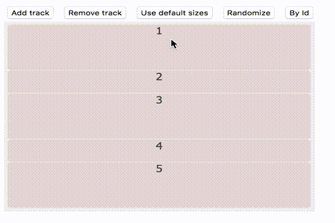

# stckr
A flexible, drag-and-drop enabled stack widget. stckr is API driven, with the goal of keeping thing simple of customizable. stckr is based on D3 for data binding, animation and DOM selections.




## Basic Usage
```
### HTML ###
<div class="stacker">
</div>

### Script ###
var stacker = new Stacker( d3.select('.stacker'), {})
stacker.addTrack(1);
stacker.modifyTrackWeight(0, 3);
stacker.addTrack(2);
stacker.addTrack(3);
```

## Configuration
A configuration object can be passed into stckr constructor to customize its behaviour.
- useDragHandle (default false), whether to use the track or a delegate handle for dragging. Drag handle is designated *track-handle* CSS class.
- containerWeight (default -1), the maximum weight units the container will allow before employing scrollbars.
- dragEndFn a callback function to run after item swap has taken place.


## Concepts

#### ID/Ordering
stckr keeps track of item ID/order, meaning you can query and update the meta data through the API. This has some interesting possibilities - such as programmatically change the order/content, replicating a stckr instance, or synchronizing actions across multiple stckr instances. Note IDs are 0-indexed.

#### Weights
stckr supports the re-arrangement of items in a single column. Each item has an associated *weight* that denotes the height proportions. So if item1 has height 3 and item2 has weight 1.5, item1's height is twice as tall as item2.

## API
- addTrack(str)
- removeTrack(id)
- modifyTrackWeight(id, number)
- modifyOrders(orders)
- setWeightThreshold(number)
